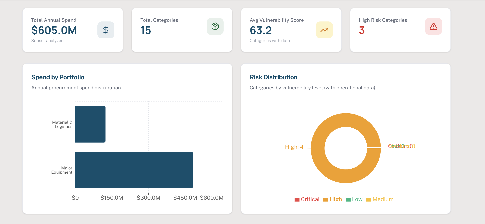
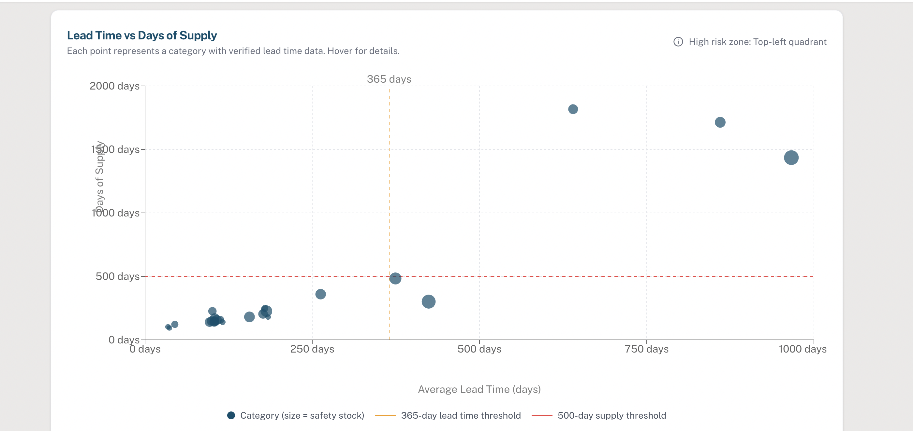
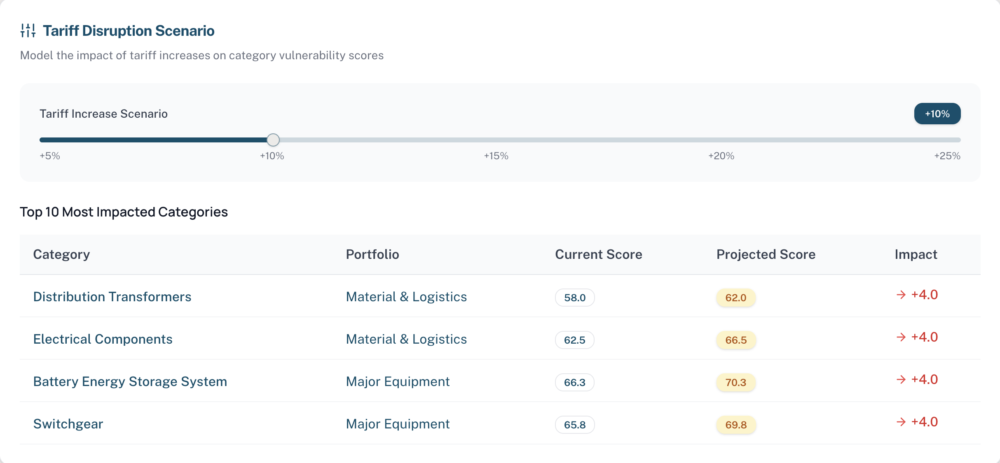
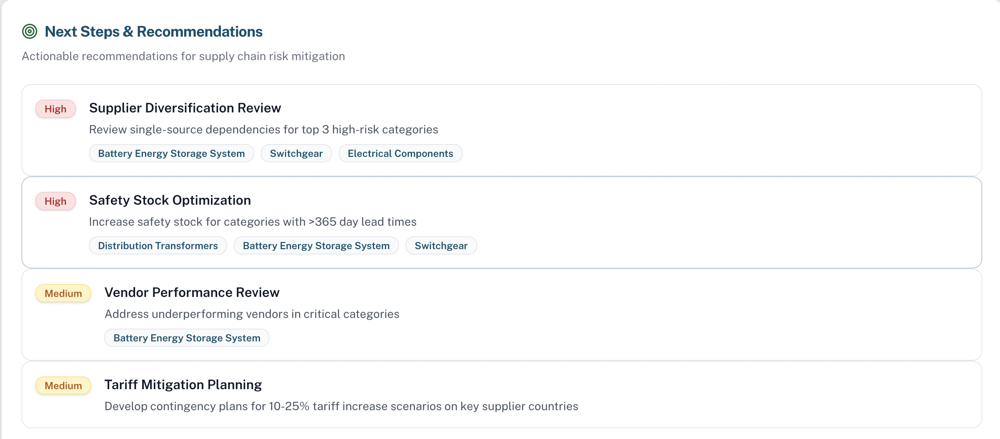

# BC Hydro Supply Chain Risk Dashboard (Hackathon MVP)

## Overview  
This project presents a supply chain vulnerability dashboard developed for a BC Hydro category management case study. The goal is to identify procurement categories most sensitive to disruption from long lead times, low inventory buffers, supplier performance risk, and tariff exposure.

---

## Data Scope  
This MVP evaluates **15 high-priority, low-risk-tolerance procurement categories**, representing approximately **$605M in annual spend**.

> Note: This is a focused subset of BC Hydro’s broader ~$2B+ procurement portfolio.

---

## Vulnerability Scoring Framework  
A composite vulnerability score (0–100) was developed:

- Lead Time Risk (30%)
- Inventory Buffer Risk (25%)
- Risk Tolerance Criticality (20%)
- Vendor Performance Signal (15%)
- Tariff Exposure Context (10%)

Higher scores indicate greater disruption vulnerability.

---

## Dashboard Preview  

### Portfolio Overview  

### Lead Time vs Inventory Buffer  

### Tariff Exposure Scenario  

### Executive Summary  

---

## Key Insights  
- Major Equipment contains the highest concentration of disruption-sensitive categories  
- Switchgear shows extreme lead times (>800 days) and low risk tolerance  
- Tariff shocks disproportionately impact cross-border dependent components  

---

## Recommendations  
- Supplier diversification review for top-ranked categories  
- Safety stock planning for long-lead-time items  
- Expand model coverage across additional procurement portfolios  

---

## Skills Demonstrated  
- Supply chain risk analytics  
- Dashboard development & KPI design  
- Scenario-based disruption assessment  
- Executive-level insight communication  
